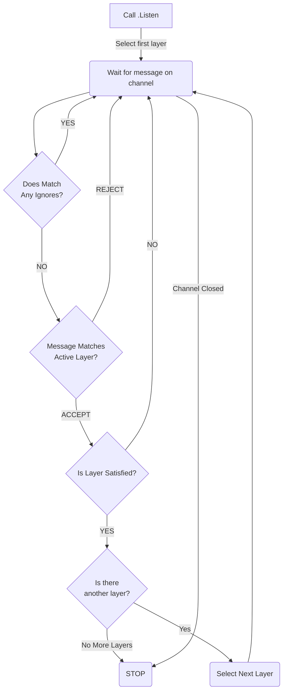

# Chan Assert
#### Asynchronous Channel Assertion Library
[](https://pkg.go.dev/github.com/hbomb79/go-chanassert)


Chan Assert is a declartive library designed to help you when writing tests which need to assert messages arriving through a channel. It's completely
generic over the type of the messages, and has an intuitive API for declaring the behaviour you expect. Additionally, extending chanassert to cover
complex testing demands is easy.

#### Usage
With chanassert, you declare your expectations of the channel beforehand. Then, after your test has finished doing it's 'work', you ask the expecter if it's satisfied.

If the expecter did not see the messages it expected to see (or saw messages it did NOT expect to see), your test will be failed with a detailed error message of what went wrong.

###### Example
If we wanted to setup an expecter which wants to see both `"hello"` and `"world"` strings pass through the expecter, you may declare your expecter like so

```golang
func Test_Xyz(t *testing.T) {
    expecter := chanassert.NewChannelExpecter(ch).
        Expect(chanassert.AllOf(
            chanassert.MatchEqual("hello"),
            chanassert.MatchEqual("world"),
        ))
    expecter.Listen()
    defer expecter.AssertSatisfied(t, time.Second)

    // Your test code here
}
```

If the above expecter sees messages it does not recognise over the `ch` channel, or did not see *both* `"hello"` and `"world"`, then the expecter will
not be satisfied, and will cause the test to fail.

Let's breakdown what's going on here:
 - `Expect` defines a new 'layer', which is a concept in chanassert which enables you to define an ordering to your expectations.
 - `AllOf` is a 'combiner', which allows you to combine multiple matchers together.
 - `MatchEqual` is an example of a matcher. It takes in a value and will 'accept' a message only if it equals the value you provide (only available if your expecter is generic over a `comparable` type).
 - `Listen` starts the expecter, which will start a goroutine which consumes messages from the channel until the expecter closes (more on that in 'Lifecycle of the Expecter')
 - `AssertSatisfied` will wait for the expecter to close (or force-close it after the timeout provided), and checks for any errors recorded by the expecter. If any are found, the given `testing.T` will be failed.

#### Key Concepts
The example above introduces a lot of the concepts which you'll need to understand to deploy chanassert effectively in your tests. Let's take a moment to cover them in some more detail.

##### Layers
Layers allow you to define an ordering to your expectations. Only one layer is active at a time, and the first layer is made active when the expecter starts. All layers accept an arbritrary number of combiners, and will become satisfied differently depending on the type of layer you're using.

Layers can be defined using 4 methods on your expecter:
- `Expect(combiners...)`, which will become satisfied when all the combiners provided are satisifed,
- `ExpectAny(combiners...)`, which will become satisfied when any of the combiners provided are satisfied,
- `ExpectTimeout(timeout, combiners...)` which is the same as `Expect`, but with a timeout,
- `ExpectAnyTimeout(timeout, combiners...)`, which is the same as `ExpectAny`, but with a timeout.

> [!IMPORTANT]
> A layers 'timeout' (if any) only starts once the layer becomes active. You do not need to compensate for timeouts from previous layers.

Most of the time you may only need one layer, however multiple layers can be added to an expecter for times when you need to establish 'and then...' semantics to your expectations.

It's important to re-iterate: messages are _only_ delivered to the **active layer**. Subsequent layers will only be used once the current layer is satisfied, and a layer will never be used
by the expecter once it's become satisfied.

---
##### Combiners
Combiners provide a way to combine multiple matchers together using a number of flexible and powerful behaviours. Combiners take
in some matchers (and some additional paramaters, depending on the combiner), and perform combination logic on your matchers.

>[!TIP]
> This is a non-exhaustive look at the high-level of combiners. The [Go Reference](https://pkg.go.dev/github.com/hbomb79/go-chanassert), [testing code](combiner_test.go), and [source code](combiner.go) are all excellent resources for understanding how each combiner behaves in detail.

For example, say I expect to see `"hello"` come over the channel at least 5 times, but no more than 7 times, this is as simple
as using the `BetweenNOf()` combiner like so:

```golang
chanassert.NewChannelExpecter(ch).Expect(
    chanassert.BetweenNOf(5, 7, chanassert.MatchEqual("hello")),
)
```

All combiners in chanassert fall in to one of three modes: `sum`, `each` and `any`. These modes dictate how a combiner becomes _satisfied_ and _saturated_.

###### Satisfied and Saturated
So far we've been talking a lot about when a combiner becomes 'satisfied', but combiners also track a concept called _saturation_.

Essentially, if satisfied means the combiner has seen the minimum quantity of messages to satisfy it's requirements, then saturated is an indication of whether the combiner can match any _more_
messages. This means satisfied is related to the `min` of a combiner, whereas saturated is all about it's `max`.

Once saturated, the combiner will simply _reject_ all incoming messages. This means that combiners, once satisfied, _stay
satisfied_ as they cannot exceed their maximum... If a combiner rejects a message due to being saturated, and no subsequent combiners can match it, then the message will be rejected and
the expecter will fail (which is a good thing, as it indicates your channel did NOT meet the expectations you set).

A combiners satisfaction and saturation state are recorded in the [expecter trace](#tracing) so that you can debug exactly why a message was rejected.

###### Sum Combiners
Sum combiners are perhaps the simplest type to understand, they become satisfied based on the **cumulative sum** of all matches it's seen.

To identify a sum combiner, you can look at it's name. Any combiner that ends in `NOf` is a sum-type combiner.

>[!TIP]
> The `OneOf(matcher...)` combiner is actually shorthand for the `ExactlyNOf(1, matcher...)` combiner, so `OneOf` is _also_ a sum-type combiner.

As an example of the 'sum' semantics, say I had a combiner like `BetweenNOf(5,7, MatchEqual("foo"), MatchEqual("bar"))`. This combiner
would become satisfied after seeing any combination of 5 messages match against it's matchers. That is to say that all of these scenarios would make the combiner satisfied:
- `"foo"`, `"bar"`, `"foo"`, `"bar"`, `"foo"`
- `"foo"`, `"foo"`, `"foo"`, `"foo"`, `"foo"`
- `"bar"`, `"bar"`, `"bar"`, `"bar"`, `"bar"`

While 5 matches satisfies the combiner, two more messages (either `"foo"` or `"bar"`) could be sent before the combiner hits it's maximum number
of matches (7 in this case) and stops accepting more messages (i.e. becomes saturated).

###### Each Combiners
Next up, _each_ type combiners. These allow you to set requirements for the number of message matches that must occur for _each_ of the matchers
you provide. You can identify each-type combiners by looking at the name; any combiner which ends in `NOfEach` is an each-type combiner.

>[!TIP]
> The `AllOf(matcher...)` combiner is actually shorthand for `ExactlyNOfEach(1, matcher...)`, so `AllOf` is also an each-type combiner.

As an example, let's say I have a combiner like `AtLeastNOfEach(2, MatchEqual("hello"), MatchEqual("world"))`, this combiner will only be satisfied
once it's seen 2 or more matches for both `"hello"` _and_ `"world"`. The order that these messages arrive is not important.

Each-type combiners also track saturation. Take this combiner for example: `BetweenNOfEach(1,2,MatchEqual("hello"), MatchEqual("world"))`, once
a matcher has matched against it's maximum number of messages (2), it will not be allowed to match against any more.

###### Any Combiners
Finally, _any_ type combiners. If you think of each type combiners as being 'AND', then any type combiners are like an 'OR'. That is to say,
the rules are basically the same, except that it becomes satisfied once _any_ of the matchers have matched against the minimum number
of messages.

Additionally, an any-type combiner will become saturated once _any_ of the matchers have matched against their maximum number of messages.

You can identify any-type combiners by looking at the name (I hope by now you can see the pattern). If a combiner ends in `NOfAny`, then you've got
yourself an any-type combiner.

---
##### Matchers
Matchers are the building block of your assertions. They are used in conjunction with combiners and layers to define your expectations.

Chanassert comes with many matchers, here's a few of the common ones:
- `MatchEqual`, matches messages which are 'equal' (using `==` comparison, and so only available if your expecter is generic over a `comparable` type).
- `MatchStruct`, matches messages using deep equality (via reflection),
- `MatchPredicate`, matches messages using the predicate function,
- `MatchStructPartial`, matches messages by comparing all _non-zero values_ in the provided struct and checking that the values match those found in the message,

To see the full set of matchers, check out the [documentation](https://pkg.go.dev/github.com/hbomb79/go-chanassert), or the [matcher test suite](matcher_test.go). If a matcher which behaves how you need isn't available,
crafting your own custom matcher is trivially easy to do.

---
##### Ignore
`Ignore()` allows you to define matchers on the expecter which are checked for each incoming message over the channel. If the
message matches any of the matchers, it is discarded.

---
##### Lifecycle of an Expecter
Now that we understand the fundamental concepts, we can explain how they all link together by discussing the lifecycle of your expecter.

A freshly created expecter (`NewChannelExpecter`) starts 'asleep'. It does not listen to the channel you've provided. First, you must
call `.Listen` on the expecter, which starts a goroutine to listen to the channel you provided.

> [!NOTE]
> An expecter becomes satisfied when it's seen all the messages it _expected_ to see, however this does not mean the expecter is without errors. A satisfied expecter may have seen messages it did *not* expect, which is not mutually exclusive with seeing all the messages it *did* expect.

Once an expecter is listening, it will make it's first layer 'active'. Any time a message is received over the channel, it will be sent to active layer to see if the message matches.

If the message was _accepted_ by the active layer, we check if the layer is satisfied (meaning all combiners it contains are satisfied);
if it is, then we select the _next layer_ until there are no more layers left (and thereby making the entire expecter satisfied).

This loop will continue to run until:
- the expecter is satisfied (i.e. all layers are satisfied),
- the expecter is terminated due to exceeding the timeout when using either of `AwaitSatisfied(timeout)` or `AssertSatisfied(t, timeout)`,
- the channel closes.



---
##### Tracing
When crafting complex assertions it can start to become difficult to figure out why your test may be failed. Is it because your channel is misbehaving, or is it because your
assertions aren't quite right...

Chanassert provides very detailed tracing capabilities which allow you to view the path each message took as it was processed by
the expecter. There are a number of ways to see this trace:
- When using `AssertSatisfied`, the trace will be printed using `(*testing.T).Log` automatically if the expecter has encountered any errors
- `PrintTrace` on the expecter (prints formatted trace to stdout),
- `FPrintTrace`, to print formatted trace to a given `io.Writer`,
- Access the trace data directly using `ProcessedMessages`.

You can see some examples of the trace chanassert outputs in the [testdata](/testdata/traces/).

#### More Examples
Please check out the testing code, especially for the [layers](layer_test.go) and [expecters](expecter_test.go). You'll find plenty
of complex examples in there.

##### Motivation
Testing channel responses can be tricky in certain scenarios, especially when integration testing. This library started out as a
helper package for integration testing the "activity stream" websocket for [Thea](http://github.com/hbomb79/Thea), with the intent
of allowing tests to make declarative assertions about what messages come through a specific channel.
